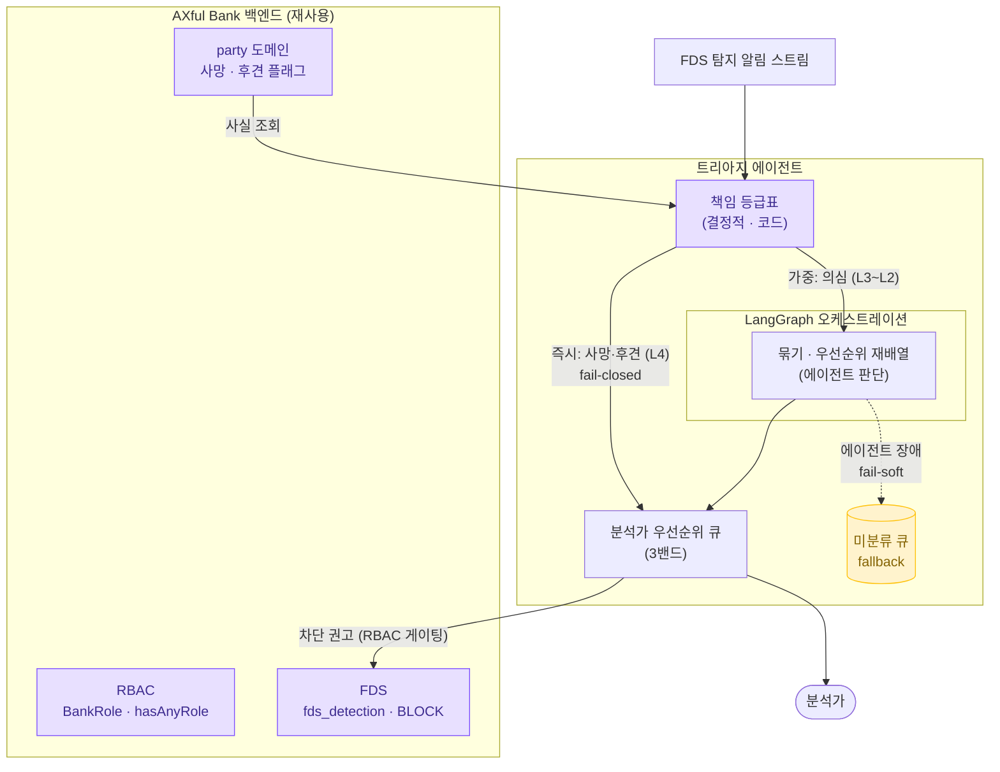

# 책임 기반 FDS 트리아지 에이전트

> 은행 이상거래 탐지 알림을 **"이상한 순"이 아니라 "책임이 무거운 순"으로 줄 세우는** 에이전트.
> 사망·후견 계좌는 금액이 작아도 즉시 최상단, 흩어진 보이스피싱은 묶어서 상위로.

---

## TL;DR

기존 FDS는 알림을 **이상도 점수**로 줄 세운다. 그런데 *이상하지 않지만 책임이 무거운* 거래 — 사망계좌 30만 원 인출 — 는 점수가 낮아 큐 맨 아래에 묻힌다. 이 에이전트는 규정상 **책임 등급(틀리면 은행이 얼마나 배상하나)** 을 우선순위에 넣어, 분석가가 가장 위험한 걸 먼저 보게 한다. AXful Bank 백엔드(JWT·party·RBAC·FDS) 위에 얹은 운영 코파일럿.

---

## 문제

- FDS 알림은 하루 수백 건, 대부분 오탐. 분석가가 한 건씩 순차로 본다.
- **이상도 점수 정렬의 사각**: "이상도 낮지만 책임 높은" 거래(사망계좌 인출, 후견 단독거래)가 줄 아래로 밀린다 — 막아야 하는 걸 늦게 본다.
- 흩어진 알림이 사실 **한 사건**(같은 수취인 보이스피싱 연발)일 때, 단건씩 보면 진행 중인 공격을 놓친다.

## 해결 — 무엇을 하나

탐지 알림 스트림을 받아 **3밴드**로 줄 세우고, 새 알림이 들어올 때마다 **실시간 재배열**한다.

1. **결정적 게이트** — 사망·후견·공동명의는 코드(if문)로 즉시 최상단 고정. 이상도 무시.
2. **에이전트 판단** — 의심 건만 묶고(같은 사건), 번지는 공격인지 평가해 동적 재배열.
3. **능동 알림/에스컬레이션** — 차단 권고·STR 검토를 근거(규정 출처)와 함께 분석가에게.

## 아키텍처 (데이터 흐름)

> 실선 = 구현/계획된 동기 흐름, 점선 = 장애 시 fallback 경로. 결정적 게이트(즉시)는 LangGraph를 우회한다.

## 핵심 차별점 — 왜 특별한가

- **점수가 아니라 책임으로 줄 세운다.** 규정 코퍼스를 **책임 등급표(L4~L0)** 로 응축 — 권리자 적격성(사망·후견)=L4 최상위, AML=L3, 소비자보호=L1. 각 판정에 규정 출처가 박혀 **감사 가능**.
- **결정적인 건 코드, 판단만 AI.** 컴플라이언스 판정(사망 차단)은 LLM에 안 맡기고 코드로 박아 비결정성·환각을 차단. LLM은 "묶기·우선순위 보정"이라는 틀려도 안전한 칸에만.
- **두뇌가 죽어도 척추는 산다.** 에이전트 장애 시 알림은 미분류 큐로 흘러 무손실, 결정적 게이트는 코드라 계속 작동. ("막는 줄 알았는데 안 막던" 사일런트 실패의 정반대.)

**안전 모드 — Fail-closed / Fail-soft 분리**

| 모드 | 적용 | 동작 |
|---|---|---|
| **Fail-closed** (차단형) | 권리자 적격성 L4 (사망·후견·공동명의) | 확정 사실 → 즉시 차단 권고, **코드가 강제**. 에이전트 우회 |
| **Fail-soft** (보조형) | 에이전트(묶기·재배열) | 장애·타임아웃 시 **미분류 큐로 무손실 진행**, 사람이 직접 판단 |

> 핵심: 차단형은 *확정 사실*에만(LLM 아님), 보조형은 *판단*에만. AI가 죽어도 결정적 차단은 멈추지 않는다.

## 데모 (작동하는 인터랙티브 콘솔)

`triage_demo.html` — 10개 이벤트를 시간차로 주입하면 큐가 실시간 재정렬된다. 세 장면:

- **이상도 무시** — 사망계좌 30만(이상도 15)이 거액 일반송금(이상도 75)을 제치고 최상단.
- **묶기** — 흩어진 보이스피싱 3건이 한 사건으로 묶이며 상위로(80→155).
- **fallback** — 에이전트 장애 시 미분류 큐로 무손실 이동, 즉시 밴드는 유지.

## 기술 스택

| 계층 | 선택 | 근거 |
|---|---|---|
| 오케스트레이션 | LangGraph (판단 루프만 감쌈) | 상태·재시도·HITL·감사 추적 |
| 모델 | 2티어 — 경량(분류) + 상위(판단), 벤더 중립 | 고볼륨은 싸게, 어려운 판단만 상위 |
| 메모리 | 작업=state, 사실=DB(party), 시맨틱=안 씀 | 결정적인 건 조회, 벡터 불필요 |
| 도구 | 계층적(조회→판단→동작), 동작은 RBAC 게이팅 | 잘못된 도구 호출=감사 구멍 |
| 모니터링 | Langfuse(트레이스) · Arize Phoenix(평가, v2) | 에이전트 결정 추적 |

**일부러 안 쓴 것** (← 판단의 증거): RAG·벡터스토어(키 조회로 충분 + 근사 검색 위험), 캐시(party는 최신성이 생명), 무거운 프레임워크 추상화(감사 구멍), 단일 모델(비용·속도), 인프라 APM(에이전트 결정 못 봄 — 다른 층).

## 기존 백엔드 자산 재사용 (AXful Bank)

| 백엔드 작업 | 에이전트에서 |
|---|---|
| ① JWT 인증 (게이트웨이 1회 검증) | 호출자 신원 확정 |
| ② party 도메인 (사망·후견 플래그) | 사실 메모리 — 책임 판정 데이터 원천 |
| ③ RBAC (`BankRole`·`hasAnyRole`) | 동작 도구(차단·STR) 권한 게이팅 |
| ④ FDS (`fds_detection`·룰·BLOCK) | 트리아지 입력 + 차단 연동 |

> 맨땅 토이가 아니라 직접 만든 백엔드를 에이전트 도구로 재배선.

## 현재 상태

- **완료**: 설계(문제·아키텍처·트레이드오프), 책임 등급표, 데모 시퀀스, **작동하는 데모 UI**(스크립트 데이터).
- **진행 예정 (2주 PoC)**: 핵심 엔진을 실제 Python으로 — 책임 등급표 조회 + 큐 묶기·재배열 + fallback. LLM·외부 연동은 목.
- **v2**: 분석가 피드백 → 가중치 보정(지속학습), 비동기·병렬, LangGraph 체크포인터, LLM 캐싱, 과거 유사사건 검색(이때 벡터 정당).

## PM 관점

원래 백엔드 작업에서 **"룰이 정의만 되고 호출부에 연결 안 돼 아무것도 안 막던"** 사일런트 실패를 직접 발견한 경험이 출발점. 분석가 머릿속에만 있던 *규정상 책임의 무게*(측정 안 되던 정성 가치)를 *우선순위 점수*(정량 지표)로 옮긴 것 — "정성 가치를 정량 지표·시스템으로 옮기는 AI Native PM".

## 파일

- `README.md` — 이 문서 (30초 요약)
- `corpus_registry.md` — 상세 설계 (규정 코퍼스 §1~11 → 책임 등급표 §12 → 기술 스택 §13 → 데모 시퀀스 §14)
- `triage_demo.html` — 작동하는 인터랙티브 데모 콘솔
